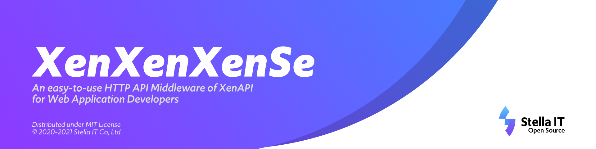

# Project XenXenXenSe
A Modern RESTful API implemenation of XenAPI for Citrix Hypervisor® and XCP-ng.  
Try not to confuse with [ZenZenZenSe (前前前世)](https://en.wikipedia.org/wiki/Zenzenzense). 
  
## Build Status
| Name                      | Status                                                                                                         |
|---------------------------|----------------------------------------------------------------------------------------------------------------|
| Python Script Black Lint  |                        |
| XenXenXenSe Unit Testing  |                          |
| FADe Debian Package Build |  |

## What is this?
Utilizing XenGarden, which is a object-oriented Python encapsulation of XenAPI, It generates RESTful API from XenGarden.

## Where does Stella IT use this?
This is a "Core Component" of Stella IT's VM Management and control system.

## Guide
### How to Install
1. Clone this repository
2. Copy config.py.example to config.py
3. Enter your credentials
4. run `pip install -r requirements.txt`  
   (or `pip3 install -r requirements.txt` if you are using both python versions)
5. run server via `python3 main.py`

### API Docs
Working in progress.  
Please refer to automatic documentation page of FastAPI (available at /docs) for this time.  

## Contributors' Guidelines
Please refer to [CONTRIBUTING.md](CONTRIBUTING.md) for more information.  

## Code of Conduct
This project has adopted Stella IT Opensource Project Code of Conduct (also known as: Stella IT HongseeLab Code of Conduct).  
Please refer to [CODE_OF_CONDUCT.md](CODE_OF_CONDUCT.md) for more information.  

## License
Distributed under MIT License.  
If you need commercial license, feel free to contact us at [contact@stella-it.com](mailto:contact@stella-it.com)  

## Copyright
Copyright (c) Stella IT Co, Ltd.
