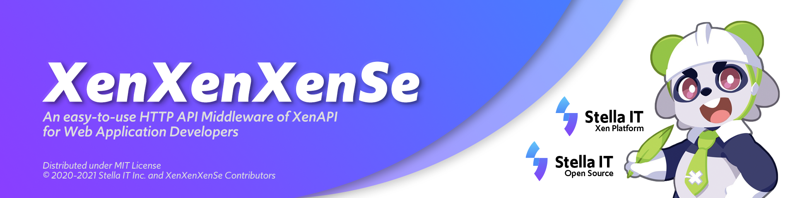

# Project XenXenXenSe
A Modern RESTful API implemenation of XenAPI for Citrix XenServer® and XCP-ng.  
Try not to confuse with [ZenZenZenSe (前前前世)](https://en.wikipedia.org/wiki/Zenzenzense). 

## What is this?
Contrary to XenAPI which requires specific instruction of that calls command, get reference, request. Instead, it uses advantages of Object Oriented Asynchrounous Python and RESTful API to create "translation layer" for XenAPI.

## API Docs
Working in progress

## Where does Stella IT use this?
This is a "Core Component" of Stella IT's VM Management and control system.

## License
Distributed under GNU AGPLv3 *(GNU Affero General Public License Version 3)*.  
If you need commercial license, feel free to contact us at [contact@stella-it.com](mailto:contact@stella-it.com)  

### License FAQ
See [LICENSE_FAQ.md](LICENSE_FAQ.md).  

## Copyright
Copyright (c) Stella IT Co, Ltd.
